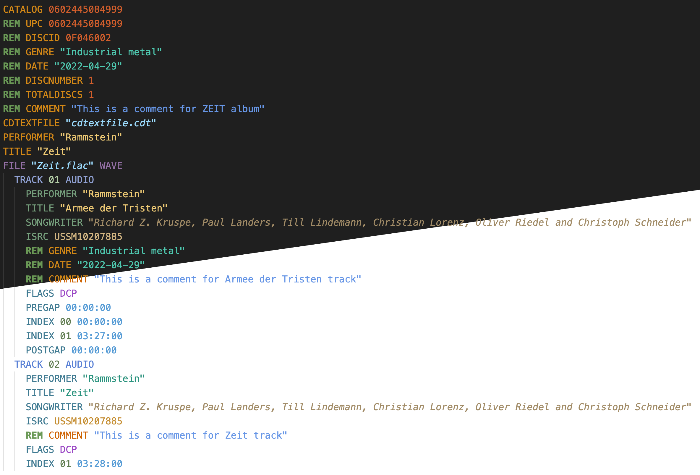
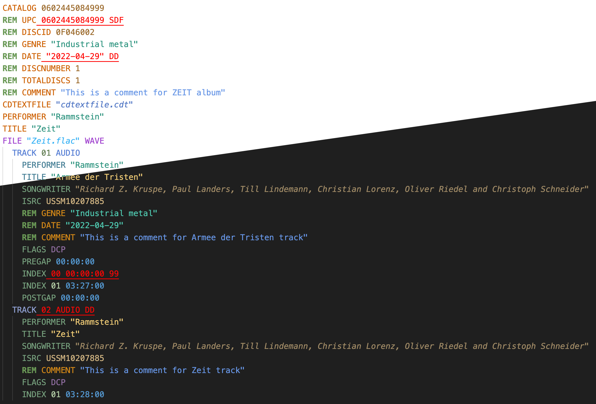
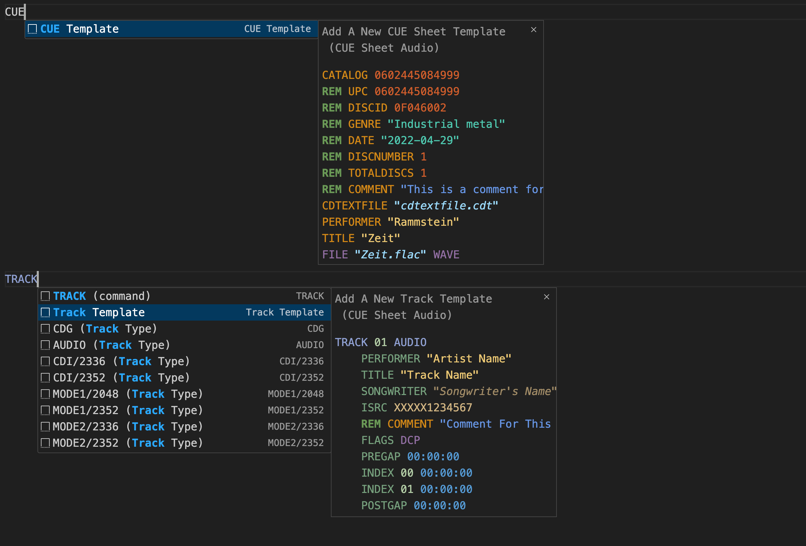
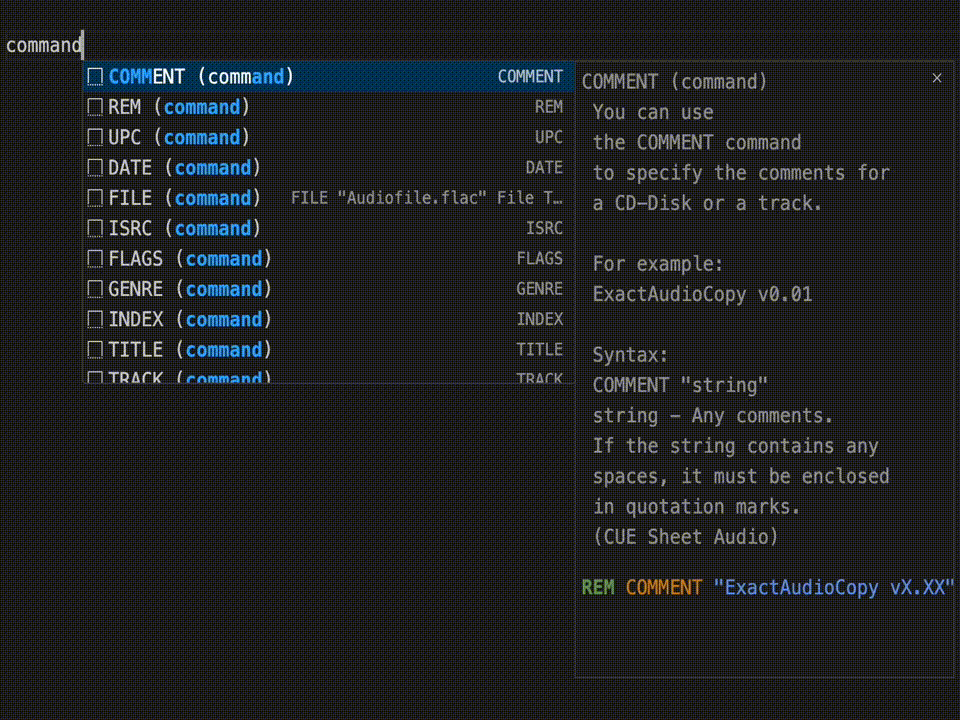

# CUE Sheet Audio  

#### This extension was created to make it easier to create and edit CUE Sheets of Audio files in VS Code
  

    

 

## Features

 
    
     
    <b>Figure 1 - Syntax colors for Dark/Light theme.</b>
     
     
     
    
     
    <b>Figure 2 - Syntax errors for Light/Dark theme.</b>
     
     
     
    
     
    <b>Figure 3 - Templates for CUE Sheet and TRACK.</b>
     
     
     
    
     
    <b>Figure 4 - All supported commands with descriptions and syntax examples.</b>

 

## Release Notes
#### RELEASE ID 0.5.0
- COMMENT "Added snippets"
 "Added a template for CUE Sheet"
 "Added a template for TRACK"
 "Added description for all CUE commands"
 "Added description for all FILE types"
 "Added description for all TRACK types"
 "Added description for all FLAGS type"
 
 

#### RELEASE ID 0.4.0
- COMMENT "The first full release"
 "Added syntax of CUE Sheet files"
 "Added syntax colors for Dark, Light and other themes"
 
 

#### RELEASE ID 0.0.0
- COMMENT "Initial release"
 
 

## Links for more information

 
    <a href="https://marketplace.visualstudio.com/items?itemName=QuantumPannonia.cue-sheet-audio" target="_blank">
         Marketplace
    </a>
     
    <a href="https://wiki.hydrogenaud.io/index.php?title=Cue_sheet" target="_blank">
         CUE Sheet information
    </a>

**Enjoy!**
